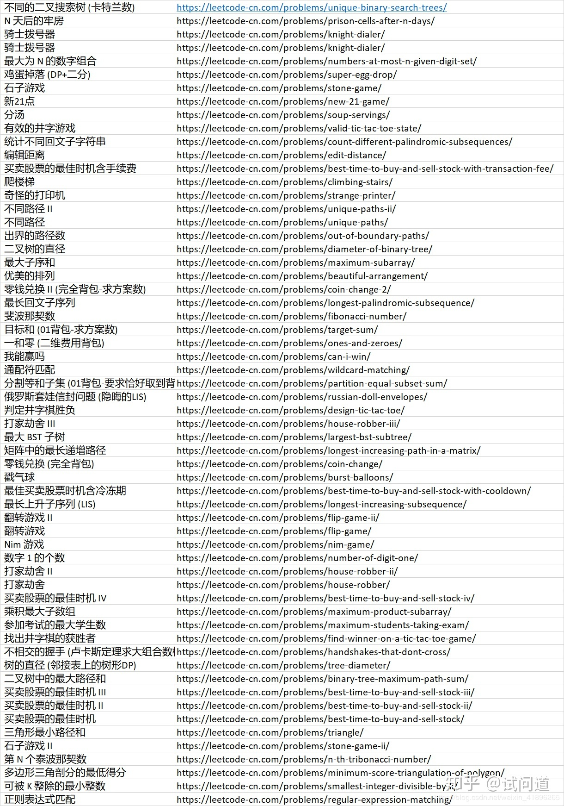
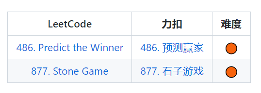

<h1 align="center"> 刷题记录互相督促</h1>

<h3 align="right">Wish we a bright future! </h3>

# 力扣上的动态规划题目

# WEEK1

### 3.28 Day1

> **今天内容**（既然你说上次动态规划失败，那我们就从失败的地方站起来！刚好我也不太会，加油！）
>
> 1. [**`题目1`**&emsp;自学KMP算法，先看思路自己写代码，后看答案](https://github.com/labuladong/fucking-algorithm/blob/master/%E5%8A%A8%E6%80%81%E8%A7%84%E5%88%92%E7%B3%BB%E5%88%97/%E5%8A%A8%E6%80%81%E8%A7%84%E5%88%92%E4%B9%8BKMP%E5%AD%97%E7%AC%A6%E5%8C%B9%E9%85%8D%E7%AE%97%E6%B3%95.md)
>
> 2. [**`题目2`**&emsp;下图选 ≥ 1道题目](https://github.com/labuladong/fucking-algorithm/blob/master/%E5%8A%A8%E6%80%81%E8%A7%84%E5%88%92%E7%B3%BB%E5%88%97/%E5%8A%A8%E6%80%81%E8%A7%84%E5%88%92%E4%B9%8B%E5%8D%9A%E5%BC%88%E9%97%AE%E9%A2%98.md)
>
>    

### 3.29 Day2

> **今天内容**   
>
> 
<b>昨天的kpi都完成的不好，今天赶上！加油！</b>

>
> 1. **`题目1`** [动态规划解题套路框架](https://labuladong.github.io/algo/di-ling-zh-bfe1b/dong-tai-g-1e688/)  **`力扣322  零钱兑换`**
>
> 2. **`题目2`**  [动态规划设计：最长递增子序列](https://labuladong.github.io/algo/di-er-zhan-a01c6/dong-tai-g-a223e/dong-tai-g-6ea57/)  **`力扣300 最长递增子序列`**
>
>    （关于一个数组中求有几个递增片段，我记得好像有一道公式，有时间可以查查，后面做完题有机会，我会查完提供在我的题解笔记中，哦！原来这个链接里有提到！可以自己查查）

### 3.30 Day3

> **今天内容**   
>
> 1. **`题目1`** [动态规划设计：最长递增子序列](https://labuladong.github.io/algo/di-er-zhan-a01c6/dong-tai-g-a223e/dong-tai-g-6ea57/)   **`力扣354  俄罗斯套娃信封问题`**

### 3.31 Day4

> **今天内容**   
>
> 1. **`题目1`**  [回溯算法解题框架](https://labuladong.github.io/algo/di-ling-zh-bfe1b/hui-su-sua-c26da/)  **`力扣51 N皇后问题`**（该链接的文章中其他题目自选做，即46、52题自己选择写不写，如果写了，也将题解放在自己笔记中）

### 4.1 Day5

> 
<b>愚人节快乐！！！加油，明天截至需要补足所有本周拖欠的 kpi 哦哦哦！干巴爹！！！</b>

>
> 1. **`题目1`** [一个方法团灭nSum问题](https://labuladong.github.io/algo/di-ling-zh-bfe1b/yi-ge-fang-894da/)   **`力扣15 三数之和`**

### 4.2 ( Rest Day)

> 
<b>虽然是休息日，但是也要学一下，任务如下</b>

>
> 1. 补足本周的题目，然后整理自己的题解，**`今天截至必须更新上周所有题自己做的题解`**
> 2. 记得看完博客，写一下**本周总结**在自己的题解笔记中（总结可以包括的内容如下，**仅供参考**的内容哦，**自己觉得总结到位就行，不强求**）
>    - 动态规划的解题套路（自行看博客或者是Google·搜索总结）
>    - 回溯算法的算法框架
>    - 踩过的坑的总结

# WEEK 2

### 4.3 Day6 

> > 
<b>新的一周开始啦！！！</b>

> >
> > 首先是上一周的复习文章链接如下
> >
> > 1. [动态规划解题框架](https://github.com/jiajunhua/labuladong-fucking-algorithm/blob/master/%E5%8A%A8%E6%80%81%E8%A7%84%E5%88%92%E7%B3%BB%E5%88%97/%E5%8A%A8%E6%80%81%E8%A7%84%E5%88%92%E8%AF%A6%E8%A7%A3%E8%BF%9B%E9%98%B6.md)
> > 2. [回溯算法解题框架](https://github.com/jiajunhua/labuladong-fucking-algorithm/blob/master/%E7%AE%97%E6%B3%95%E6%80%9D%E7%BB%B4%E7%B3%BB%E5%88%97/%E5%9B%9E%E6%BA%AF%E7%AE%97%E6%B3%95%E8%AF%A6%E8%A7%A3%E4%BF%AE%E8%AE%A2%E7%89%88.md)
> >
> > **今天的任务**
> >
> > 1. **`题目1`** [滑动窗口解题框架](https://github.com/jiajunhua/labuladong-fucking-algorithm/blob/master/%E7%AE%97%E6%B3%95%E6%80%9D%E7%BB%B4%E7%B3%BB%E5%88%97/%E6%BB%91%E5%8A%A8%E7%AA%97%E5%8F%A3%E6%8A%80%E5%B7%A7.md)  **`力扣49  字母异位词分组 （Medium）`**（这题我之前做过了）
> > 2. **`题目2`** [滑动窗口解题框架](https://github.com/jiajunhua/labuladong-fucking-algorithm/blob/master/%E7%AE%97%E6%B3%95%E6%80%9D%E7%BB%B4%E7%B3%BB%E5%88%97/%E6%BB%91%E5%8A%A8%E7%AA%97%E5%8F%A3%E6%8A%80%E5%B7%A7.md)  **`力扣3  无重复字符串的最长子串 （Medium）`**（这题我之前做过了）
> > 3. **附加任务（选做）**
> >    - **`题目1`** [滑动窗口解题框架](https://github.com/jiajunhua/labuladong-fucking-algorithm/blob/master/%E7%AE%97%E6%B3%95%E6%80%9D%E7%BB%B4%E7%B3%BB%E5%88%97/%E6%BB%91%E5%8A%A8%E7%AA%97%E5%8F%A3%E6%8A%80%E5%B7%A7.md)  **`力扣76  最小覆盖子串（Hard）`**
>
> 
<b>数据结构方面（想了想还是先复习数据结构，后面再搞排序）</b>

>
> **`力扣可以查找相关题型`**
>
> 
>

> **`链表`**
>
> 自己找链表部分的博客或者书籍看，整理一下，然后力扣上做**`2道链表题`**（难度不限）

### 4.4 Day7

> 
<b>昨天的kpi我今天是一点也没完成，可恶！！！</b>

>
> **今天的任务**
>
> 1. **`题目1`** [编辑距离](https://github.com/jiajunhua/labuladong-fucking-algorithm/blob/master/%E5%8A%A8%E6%80%81%E8%A7%84%E5%88%92%E7%B3%BB%E5%88%97/%E7%BC%96%E8%BE%91%E8%B7%9D%E7%A6%BB.md)  **`力扣72  编辑距离 （Hard）`**
> 
> 
<b>数据结构方面</bb>

> 
>**`树`**
> 
>复习相关概念，熟悉各种**`遍历方式`**的框架 ( 层次遍历、前中后序遍历 )
> 
>复习**`DFS和BFS`**
> 
>找不找题做自己决定，若找了，放在题解中，题解中要看到数据结构部分的笔记

### 4.5 如你所愿 清明放假

### 4.6 Day8

> 
<b>加把劲哟！</b>

>
> [动态规划之四字键盘](https://github.com/jiajunhua/labuladong-fucking-algorithm/blob/master/%E5%8A%A8%E6%80%81%E8%A7%84%E5%88%92%E7%B3%BB%E5%88%97/%E5%8A%A8%E6%80%81%E8%A7%84%E5%88%92%E4%B9%8B%E5%9B%9B%E9%94%AE%E9%94%AE%E7%9B%98.md)（本来想作为题目的，结果发现需要会员才能做这题，因此阅读本文章即可，自己想想思路，不必做题了）
>
> 1. [**`题目1—— 力扣887 鸡蛋掉落（Hard）`**](https://github.com/jiajunhua/labuladong-fucking-algorithm/blob/master/%E5%8A%A8%E6%80%81%E8%A7%84%E5%88%92%E7%B3%BB%E5%88%97/%E9%AB%98%E6%A5%BC%E6%89%94%E9%B8%A1%E8%9B%8B%E9%97%AE%E9%A2%98.md)
>
> 
<b>数据结构方面</bb>

>
> 树的数据结构方面找一个编程题做做

### 4.7 Day9

> 
<b>感觉题还是有点多的，今天偷懒，布置一道Medium >_< </b>

>
> 1. **`题目1—— 力扣1040 移动石子直到连续（Medium）`**

### 4.8 Day10

> 
<b>今天布置一道Medium >_< 和前缀和有关，可以看提供博客的前缀和教程（但是没有选择它的例题） </b>

>
> 1. **`题目1—— 力扣304 二维区域和检索-矩阵不可变（Medium）`**
>
> [博客前缀和链接](https://github.com/jiajunhua/labuladong-fucking-algorithm/blob/master/%E7%AE%97%E6%B3%95%E6%80%9D%E7%BB%B4%E7%B3%BB%E5%88%97/%E5%89%8D%E7%BC%80%E5%92%8C%E6%8A%80%E5%B7%A7.md)

# WEEK 3

### 4.10 Day11

> 

> 1. **`题目1—— leetcode剑指offer36 二叉搜索树与双向链表（Medium）`**
