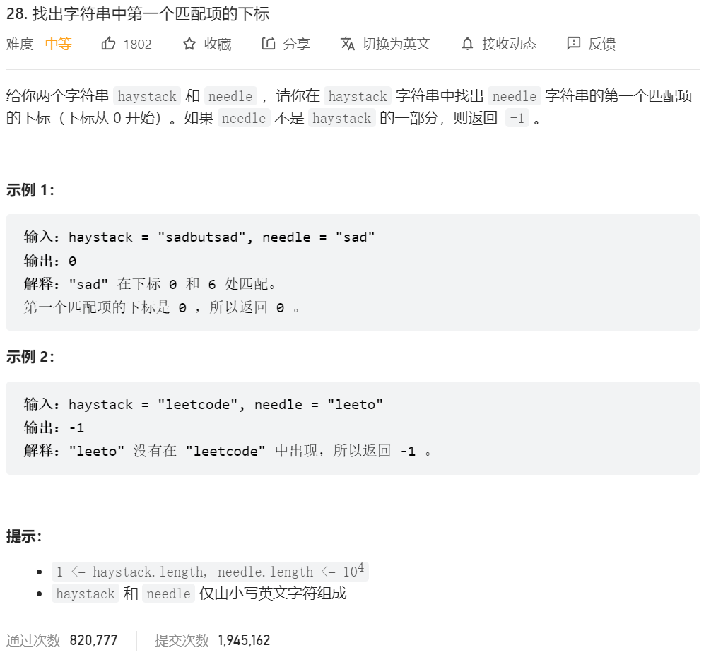

# 题解

## 2023.3.28 力扣28、

## `28、找出字符串中第一个匹配项的下标`




```C++
class Solution {
public:
    int strStr(string haystack, string needle) {
        //haystack的指针
        int left=0;
        //needle的指针
        int right=0;
        int len=needle.size();
        for(;left<haystack.size();){
            //如果相等。两个指针都往前走
            if(haystack[left]==needle[right]){
                left++;
                right++;
            }
            if(haystack[left]!=needle[right]){
                //right达到长度，说明已经有匹配完成的，直接返回
                if(right==len){
                    return left-len;
                }
                //right达不到长度，说明未匹配完成，将left回退，然后right清零
                else{
                    left=left-right+1;
                    right=0;
                }
            }
        }
        //有可能最后刚好匹配完，因跳出循环，所以上面没有return这里需要判断一下
        if(right==len) return left-len;
        else return -1;

    }
};
//JS代码将 int 换成 let 而已，故不再写 js 版本代码
```

