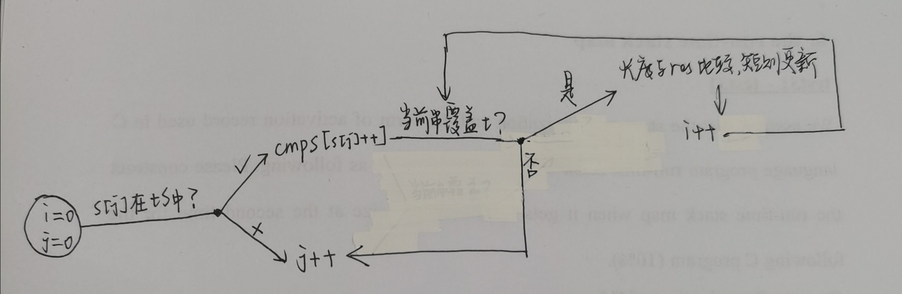

# 题解

# 2023.3.28 力扣28（字符串匹配KMP）、力扣486、877（博弈动态规划）

## [`28、找出字符串中第一个匹配项的下标`](https://leetcode.cn/problems/find-the-index-of-the-first-occurrence-in-a-string/)

```C++
class Solution {
public:
    int strStr(string haystack, string needle) {
        //haystack的指针
        int left=0;
        //needle的指针
        int right=0;
        int len=needle.size();
        for(;left<haystack.size();){
            //如果相等。两个指针都往前走
            if(haystack[left]==needle[right]){
                left++;
                right++;
            }
            if(haystack[left]!=needle[right]){
                //right达到长度，说明已经有匹配完成的，直接返回
                if(right==len){
                    return left-len;
                }
                //right达不到长度，说明未匹配完成，将left回退，然后right清零
                else{
                    left=left-right+1;
                    right=0;
                }
            }
        }
        //有可能最后刚好匹配完，因跳出循环，所以上面没有return这里需要判断一下
        if(right==len) return left-len;
        else return -1;

    }
};
//JS代码将 int 换成 let 而已，故不再写 js 版本代码
```

## [`486、预测赢家`](https://leetcode.cn/problems/predict-the-winner/)

```C++
class Solution {
public:
    bool PredictTheWinner(vector<int>& nums) {
        //dp的含义，该ij区间先手和后手能拿到的值
        //初始化dp右上角
        pair<int,int> dp[20][20];
        for(int i=0;i<20;i++)
        for(int j=i;j<20;j++){
            dp[i][j].first=0;
            dp[i][j].second=0;
        }
        //初始化对角线
        //情况：如果只有一个数，先手可以选择该数，后手无数可选为0
        for(int i=0;i<nums.size();i++){
            dp[i][i].first=nums[i];
            dp[i][i].second=0;
        }
        for(int i=nums.size()-2;i>=0;i--)
        for(int j=i+1;j<nums.size();j++){
            //算出选左选右右的值
            //如果选左，那么下一次是后手
            int left=nums[i]+dp[i+1][j].second;
            int right=nums[j]+dp[i][j-1].second;
            //选了左，当前的先手和后手进行更新
            if(left>right){
                dp[i][j].first=left;
                dp[i][j].second=dp[i+1][j].first;
            }
            else{
                dp[i][j].first = right;
                dp[i][j].second = dp[i][j-1].first;
            }
        }
        //最终结果就是区间0~size()-1的先手和后手进行比较
        pair<int,int> p=dp[0][nums.size()-1];
        if((p.first-p.second)>=0) return true;
        return false;
    }
};
```

# 2023.3.29 力扣322（零钱兑换）、力扣

## [`322、零钱兑换`](https://leetcode.cn/problems/coin-change/)

```C++
class Solution {
public:
    int coinChange(vector<int>& coins, int amount) {
        //dp[i]代表金额为i的最少硬币个数
        int dp[10001]={[0 ... 10000] = 10002};
        //初始化
        for(int i=0;i<coins.size();i++){
            //硬币面值超过金额，不考虑（此处=注意）
            if(coins[i]<=amount)
            dp[coins[i]]=1;
        }
        dp[0]=0;
        //动态规划转移方程
        for(int i=1;i<=amount;i++){
            if(dp[i]==10002){
                for(int j=0;j<coins.size();j++){
                    if(i-coins[j]>0&&dp[(i-coins[j])]!=10002)
                    dp[i]=min(1+dp[(i-coins[j])],dp[i]);
                }
            } 
        }
        if(dp[amount]==10002) return -1;
        else return dp[amount];
    }
};
```

## [`300、最长递增子序列`](https://leetcode.cn/problems/longest-increasing-subsequence/submissions/)

```C++
//此题的难点在于如何定义dp
//没想出如何定义dp，看了一下dp定义，然后自己写的，一次就过！
//一个好的dp定义真的很重要！！！！
class Solution {
public:
    int lengthOfLIS(vector<int>& nums) {
        //dp[i]表示以nums[i]结尾的最长严格递增子序列长度
        int dp[2500];
        //初始化数组
        for(int i=0;i<2500;i++){
            dp[i]=1;
        }
        //dp[i]的值，为小于i的j,即dp[j]+1(且nums[i]>nums[j])
        for(int i=1;i<nums.size();i++){
            for(int j=0;j<i;j++){
                if(nums[i]>nums[j]){
                    dp[i]=max(dp[j]+1,dp[i]);
                }
            }
        }
        //输出dp数组中的最大值
        int temp=0;
        for(int i=0;i<nums.size();i++){
            if(dp[i]>temp) temp=dp[i];
        }
        return temp;
    }
};
```

**`二分法查找解法`**

> 最长递增子序列和一种叫做 *patience game*的纸牌游戏有关，有一种排序算法叫做***patience sorting***
>
> **纸牌遍历顺序拿取，规则如下:**只能把点数小的牌压到点数比它大的牌上；如果当前牌点数较大没有可以放置的堆，则新建一个堆，把这张牌放进去；如果当前牌有多个堆可供选择，则选择最左边的那一堆放置。最终得到的堆数就是最长递增子序列长度
>
> **思路如下**
>
> > - 用vector创建一个数组放每一个堆的堆顶，对于每一张牌，用二分查找找到它应插入的位置，如果找不到，新建一个堆
> > - 遍历完所有牌以后，数组的长度就是最长递增子序列的长度了

# 2023.3.31 力扣354（俄罗斯套娃信封）

## [`354、俄罗斯套娃信封`](https://leetcode.cn/problems/russian-doll-envelopes/)

> **思路**
>
> 1. 先对二维中的第一维进行非降序排序
>
>    自定义 *cmp* 函数 (这里复习上次最长递增子序列中提到，`对于第二位要采取非升序排序`)
>
> 2. 对于第二位进行找到最长递增子序列即可
>
>    一开始用昨天29的求最长递增子序列的方法，时间复杂度太高。。。
>
>    所以复习了那篇博客中的二分查找解法（详见29笔记补充），终于AC了
>
> ```C++
> class Solution {
> private:
>     //自定义比较函数，第一维非降序排列，当第一维数字相同，第二位按照非升序排列
>  static bool  cmp(const vector<int> &a, const vector<int> &b){
>      if(a[0]<b[0]) return true;
>      else if(a[0]==b[0]&&a[1]<=b[1]) return false;
>      else if(a[0]==b[0]&&a[1]>b[1]) return true;
>      else return false;
> 
>  }
> public:
>     int maxEnvelopes(vector<vector<int>>& envelopes) {
>         sort(envelopes.begin(),envelopes.end(),cmp);
>         int dp[100001]={0};
>         //数组初始化
>         for(int i=0;i<envelopes.size();i++){
>             dp[i]=1;
>         }
>         //堆数
>         int piles=0;
>         vector<int> res;
>         for(int i=0;i<envelopes.size();i++){
>             int left=0,right=res.size();
>             //二分查找确定是能找到堆插入还是新建堆
>             while(left<right){
>                 int mid=(left+right)/2;
>                 if(res[mid]>envelopes[i][1]){
>                     right=mid;
>                 }
>                 if(res[mid]<envelopes[i][1]){
>                     left=mid+1;
>                 }
>                 else{
>                     right=mid;
>                 }
>             }
>             if(left==piles) {
>                 res.push_back(envelopes[i][1]);
>                 piles++;
>             }
>             res[left]=envelopes[i][1];
>         }
>         //向量的长度就是最长递增子序列
>         return res.size();
>     }
> };
> ```
>
> 

## [`354、N皇后问题`](https://leetcode.cn/problems/n-queens/submissions/)

> **思路**（标记红色的是此题感觉比较难的）
>
> 对于回溯，最重要的是三个地方
>
> 1. 路径记录（这个此题中就是满足条件的一种解，没什么好说的）
> 2. `可选范围`（这个在此题中比较隐蔽，这里其实是n种位置的排列组合，每一种Q的位置代表选择范围中的一个元素）
> 3. 选择范围的标记（怎么判断是否要结束该路径继续，`此题对角线说明行数和列数的差的绝对值相等`）
>
> 剩下的套一下回溯框架没啥好说的啦！
>
> ```C++
> class Solution {
> private:
>     //最终结果
>     vector<vector<string>> res;
>     //将每一行的情况保留下来，最终结果其实就是每一行的排列组合
>     vector<string> strs;
>     //path保存路径，strs保存每一行的可能情况（n种，flag判断是否某行已经用过，stack用来记录之前走过的行对应的Q的位置）
>     void backtrack(vector<string> &path, vector<string> &strs,vector<bool> &flag,vector<int> &rec,int dep){
>         //路径长度达到返回结果
>         if(path.size()==strs.size()){
>             res.push_back(path);
>         }
>         for(int i=0;i<strs.size();i++){
>             //该种Q位置的情况还没有被用过
>             if(!flag[i]) continue;
>             bool cFlag=false;
>             //对角线条件符合就抛弃该种情况的Q位置
>             for(int j=0;j<rec.size();j++){
>                 if(abs(dep-j)==abs(rec[j]-i)){
>                     cFlag=true;
>                     break;
>                 }
>             }
>             if(cFlag==true) continue;
>             //没啥好说的，套路
>             path.push_back(strs[i]);
>             rec.push_back(i);
>             flag[i]=false;
>             backtrack(path,strs,flag,rec,dep+1);
>             flag[i]=true;
>             rec.pop_back();
>             path.pop_back();
>         }
> 
>     }
> public:
>     vector<vector<string>> solveNQueens(int n) {
>         //生成每一行的情况
>         for(int i=0;i<n;i++){
>             string s(n,'.');
>             s[i]='Q';
>             strs.push_back(s);
>         }
>         //用于标记哪一行已经出现
>         vector<bool> flag(n,true);
>         //用于存储某一种情况的路径
>         vector<string> path;
>         //用来存储已经在队列中的Q的位置
>         vector<int> rec;
>         //回溯
>         backtrack(path,strs,flag,rec,0);
>         return res;
>     }
> };
> ```
>
> 

# 2023.4.1 力扣15 三数之和

## [`15、三数之和`](https://leetcode.cn/problems/3sum/)

> **思路**
>
> 1. 三个指针，第一个指针遍历整个数组，遇到相同的元素需要跳
> 2. 第二个指针初始化为第一个指针的后一个数，遇到相同的数也要跳
> 3. 第三个指针初始化为数组最后一个数，从后往前走，遇到相同的数跳
> 4. 其他细节见代码注释
>
> ```C++
> class Solution {
> private:
>     vector<vector<int>> res;
> public:
>     vector<vector<int>> threeSum(vector<int>& nums) {
>         //对数组进行排序，可以后面跳相同数
>         sort(nums.begin(),nums.end());
>         //==0说明第一个数一定是非正数
>         for(int i=0;i<nums.size()-2&&nums[i]<=0;i++){
>             //初始化第二、第三个指针
>             int q=nums.size()-1,p=i+1;
>             while(p<q){
>                 int sum=nums[i]+nums[p]+nums[q];
>                 //注意此处left、right初始化位置（---------踩得坑-----------）
>                 int left=nums[p],right=nums[q];
>                 if(sum<0) {
>                     //注意此处及以下的每种情况，都应该先移动指针再进行while循环判断是否有重复元素（---------踩得坑-----------）
>                     p++;
>                     while(p<q&&nums[p]==left)p++;
>                 }
>                 else if(sum==0){
>                     vector<int> temp={nums[i],left,right};
>                     res.push_back(temp);
>                     p++;
>                     q--;
>                     while(p<q&&nums[p]==left)p++;
>                     while(p<q&&nums[q]==right)q--;
>                 }
>                 else if(sum>0){
>                     q--;
>                     while(p<q&&nums[q]==right)q--;
>                 }
>             }
>             //这里的i要限制大小（---------踩得坑-----------）
>             while(i<nums.size()-1&&nums[i]==nums[i+1]){
>                 i++;
>             };
>         }
>         return res;
>     }
> };
> ```
>
> 

# 2023.4.5 力扣76 最小覆盖字串

## [`76、最小覆盖字串`](https://leetcode.cn/problems/minimum-window-substring/submissions/)

> **思路**
>
> 1. 快慢指针均从0开始
> 2. 快指针移动到满足覆盖子串以后，移动慢指针到不满足覆盖字串
> 3. 移动快指针至满足覆盖字串
> 4. 比较和之前保存结果的长度，当前更短则更新结果
>
> `踩坑`
>
> - 首先是几个循环的流程写乱了
>
>   见流程图
>
>   
>
> - 其次选择什么结构表示覆盖子串
>
>   一开始选择的set\<char\>，发现还应该记录当前子串中各个字符的数量，想着选择set\<\<char，int>\>，发现遍历之类的处理不如map方便，最终选择map
>
> - 然后是几个判断条件位置（具体见代码中说明）
>
> ```C++
> class Solution {
> private:
>     //----------------踩坑2------------------------------
>     bool cmpMap(map<char,int> &tS, map<char,int> &cmpS){
>         map<char,int>::iterator tI,cI;
>         bool flag=true;
>         for(tI=tS.begin(),cI=cmpS.begin();tI!=tS.end();tI++,cI++){
>             if(*tI>*cI) {
>                 flag=false;
>                 return flag;
>             }
>         }
>         return flag;
>     }
> public:
>     string minWindow(string s, string t) {
>         //初始化res的长度大于s
>         string res=s+"a";
>         //初始化i=0；j往后移动，一旦满足set中所有的字符和数量，i往前移动，然后再重复此过程
>         //存目标子串中每个字符的个数
>         map<char,int> tS;\
>         //当前子串中各个目标字符的个数
>         map<char,int> cmpS;
>         //将字符作为键，数量作为键值，初始化两个map
>         for(int i=0;i<t.size();i++){
>             tS[t[i]]++;
>             cmpS[t[i]]=0;
>         }
>         //cout<<cmpS.size()<<" "<<tS.size()<<endl;
>         int i=0,j=0;
>         //---------------------踩坑3.1--------------------------------思考选择 j  作为判断结束的条件 
>         while (j<s.size()) {
> 			//cout << "outer:" << i << " " << j << endl;
> 			map<char, int>::iterator it = tS.find(s[j]);
> 			if (it != tS.end()) {
> 				cmpS[s[j]]++;
> 				// 判断是否已经包含t中所有的字符，如果是且当前字串长度小于目前的结果，更新结果，否则不更新
>                   //---------------------踩坑3.2--------------------------------不能在这个while中判断 if(j - i + 1 < res.size())
> 				while (cmpMap(tS,cmpS)) {
> 					//cout << "inner:" << i << " " << j << endl;
> 					if(j - i + 1 < res.size()) res = s.substr(i, j - i + 1);
> 					map<char, int>::iterator it = tS.find(s[i]);
> 					if (it != tS.end()) cmpS[s[i]]--;
> 					i++;
> 				}
> 			}
> 			//j增大到s.size,说明只能移动i，--------------------解释踩坑3.1----------------
> 		    j++;
> 		}
>         if(res.size()==s.size()+1) return "";
>         else return res;
>     }
> };
> ```
>
> **可恶的是最后一个测试用例超时了**
>
> 
>
> 于是贴上别人的题解。。。。。。。。。。。。。。。
>
> ```C++
> class Solution {
> public:
> // 本题使用滑动窗口求解，即两个指针 l 和 r 都是从最左端向最右端移动，且 l 的位置一定在 r 的左边或重合。
> //注意本题虽然在 for 循环里出现了一个 while 循环，但是因为 while 循环负责移动 l 指针，
> //且 l 只会从左到右移动一次，因此总时间复杂度仍然是 O(n)。
> //本题使用了长度为 128的数组来映射字符，也可以用哈希表替代；
> //其中 chars 表示目前每个字符缺少的数量，flag 表示每个字符是否在 T 中存在。
>     string minWindow(string s, string t) {
>         //这里是int
>         vector<int>chars(128,0);
>         //这里是bool
>         vector<bool>flags(128,0);
>         //遍历一遍t这个字符串
>         for(int i =0;i<t.size();i++)
>         {
>             chars[t[i]]++;
>             flags[t[i]] = true;
>         }
> 
>         // 移动滑动窗口，不断更改统计数据
>         int cnt = 0;
>         int l = 0;
>         //这里是为了最后取字符串的开头
>         int  min_l = 0;
>         //最小字符串长度
>         int  min_size = s.size() + 1;
>         //遍历s字符串 r在这里
>         for(int r=0;r<s.size();r++)
>         {
>             //确定s这个字符在t中存在，如果存在就更新cahrs的值，直到chars值为0，则结束
>             if(flags[s[r]])
>             {
>                 if(--chars[s[r]]>=0)
>                 {
>                     ++cnt;
>                 }
>                 //cnt和t的字符串长度一致的时候，就证明已经找到了包含t子串的子字符串了
>                 //需要进行缩减处理
>                 while(cnt == t.size())
>                 {
>                     //更新l和min_size
>                     if(r-l+1 < min_size)
>                     {
>                         //min_l 是左值
>                         min_l =l;
>                         min_size = r-l+1;
>                     }
>                     //这里确定是不是到了符合t的部分
>                     if (flags[s[l]] && ++chars[s[l]] > 0) {
>                         --cnt;
>                     }
>                     ++l;
>                 }
>             }
>         }
>         return min_size > s.size()? "": s.substr(min_l, min_size);
> 
>     }
> };
> ```
>
> 

## [`2、两数相加（链表）`](https://leetcode.cn/problems/minimum-window-substring/submissions/)

> **思路**
>
> ```C++
> /**
>  * Definition for singly-linked list.
>  * struct ListNode {
>  *     int val;
>  *     ListNode *next;
>  *     ListNode() : val(0), next(nullptr) {}
>  *     ListNode(int x) : val(x), next(nullptr) {}
>  *     ListNode(int x, ListNode *next) : val(x), next(next) {}
>  * };
>  */
> class Solution {
> private:
>     //用于返回结果
>     ListNode* head=new ListNode(0);
>     //用于新建的结果的当前节点
>     ListNode* end=head;
>     //用于记录进位
>     int add=0;
> public:
>     ListNode* addTwoNumbers(ListNode* l1, ListNode* l2) {
>         //均不为空，先生成新节点计算当前值，然后
>         while(l1!=nullptr&&l2!=nullptr){
>             ListNode* newN=new ListNode(add);
>             add=(l1->val+l2->val+newN->val)/10;
>             newN->val=(l1->val+l2->val+newN->val)%10;
>             //----------------------坑1----------------一开始这两行代码写在了l1->next后面，逻辑错了
>             end->next=newN;
>             end=newN;
>             //均空说明两个长度相等，要判断有没有进位
>             if(l1->next==nullptr&&l2->next==nullptr&&add==1){
>                 ListNode* newFinal=new ListNode(add);
>                 end->next=newFinal;
>             }
>             l1=l1->next;
>             l2=l2->next;
>         }
>         //l1更长
>         while(l1!=nullptr){
>             ListNode* newN1=new ListNode(add);
>             add=(l1->val+newN1->val)/10;
>             newN1->val=(l1->val+newN1->val)%10;
>             end->next=newN1;
>             end=newN1;
>             if(l1->next==nullptr) {
>                 if(add==1){
>                     ListNode* newN11=new ListNode(add);
>                     end->next=newN11;
>                 }
>                 break;
>             }
>             l1=l1->next;
>         }
>         //l2更长
>         while(l2!=nullptr){
>             ListNode* newN2=new ListNode(add);
>             add=(l2->val+newN2->val)/10;
>             newN2->val=(l2->val+newN2->val)%10;
>             end->next=newN2;
>             end=newN2;
>             if(l2->next==nullptr){
>                 if(add==1){
>                     ListNode* newN21=new ListNode(add);
>                     end->next=newN21;
>                 }
>                 break;
>             }
>             l2=l2->next;
>         }
>         //head是一个虚拟节点
>         return head->next;
>     }
> };
> ```
>
> **`官方题解写的简洁多了`**
>
> ```C++
> class Solution {
> public:
>     ListNode* addTwoNumbers(ListNode* l1, ListNode* l2) {
>         ListNode *head = nullptr, *tail = nullptr;
>         int carry = 0;
>         while (l1 || l2) {
>             int n1 = l1 ? l1->val: 0;
>             int n2 = l2 ? l2->val: 0;
>             int sum = n1 + n2 + carry;
>             if (!head) {
>                 head = tail = new ListNode(sum % 10);
>             } else {
>                 tail->next = new ListNode(sum % 10);
>                 tail = tail->next;
>             }
>             carry = sum / 10;
>             if (l1) {
>                 l1 = l1->next;
>             }
>             if (l2) {
>                 l2 = l2->next;
>             }
>         }
>         if (carry > 0) {
>             tail->next = new ListNode(carry);
>         }
>         return head;
>     }
> };
> //别人的题解
> class Solution {
> public:
>     ListNode* addTwoNumbers(ListNode* l1, ListNode* l2) {
>         ListNode* node = nullptr;
>         ListNode** n = &node;
>         int ca = 0;
>         while(l1 || l2 || ca){
>             int sum = ca;
>             sum += l1? l1->val: 0;
>             sum += l2? l2->val: 0;
>             ca = sum / 10;
>             *n = new ListNode(sum % 10);
>             n = &((*n)->next);
>             if(l1) l1 = l1->next;
>             if(l2) l2 = l2->next;
>         }
>         return node;
>     }
> };
> //递归写法
> class Solution {
> public:
>     ListNode* addTwoNumbers(ListNode* l1, ListNode* l2, int carry = 0) {
>         if(l1 == l2 && l1 == nullptr && carry == 0)
>             return nullptr;
>         int tmp = carry + (l1 ? l1->val : 0) + (l2 ? l2->val : 0);
>         carry = tmp / 10;
>         return new ListNode(tmp%10, addTwoNumbers((l1 ? l1->next : nullptr), (l2 ? l2->next : nullptr), carry));
>     }
> };
> ```
>
> 
