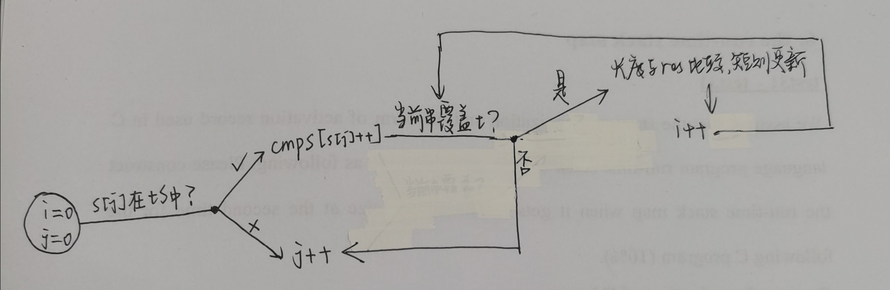

# WEEK 2

### [`76、最小覆盖字串`](https://leetcode.cn/problems/minimum-window-substring/submissions/)

> **思路**
>
> 1. 快慢指针均从0开始
> 2. 快指针移动到满足覆盖子串以后，移动慢指针到不满足覆盖字串
> 3. 移动快指针至满足覆盖字串
> 4. 比较和之前保存结果的长度，当前更短则更新结果
>
> `踩坑`
>
> - 首先是几个循环的流程写乱了
>
>   见流程图
>
>   
>
> - 其次选择什么结构表示覆盖子串
>
>   一开始选择的set\<char\>，发现还应该记录当前子串中各个字符的数量，想着选择set\<\<char，int>\>，发现遍历之类的处理不如map方便，最终选择map
>
> - 然后是几个判断条件位置（具体见代码中说明）
>
> ```C++
> class Solution {
> private:
>     //----------------踩坑2------------------------------
>     bool cmpMap(map<char,int> &tS, map<char,int> &cmpS){
>         map<char,int>::iterator tI,cI;
>         bool flag=true;
>         for(tI=tS.begin(),cI=cmpS.begin();tI!=tS.end();tI++,cI++){
>             if(*tI>*cI) {
>                 flag=false;
>                 return flag;
>             }
>         }
>         return flag;
>     }
> public:
>     string minWindow(string s, string t) {
>         //初始化res的长度大于s
>         string res=s+"a";
>         //初始化i=0；j往后移动，一旦满足set中所有的字符和数量，i往前移动，然后再重复此过程
>         //存目标子串中每个字符的个数
>         map<char,int> tS;\
>         //当前子串中各个目标字符的个数
>         map<char,int> cmpS;
>         //将字符作为键，数量作为键值，初始化两个map
>         for(int i=0;i<t.size();i++){
>             tS[t[i]]++;
>             cmpS[t[i]]=0;
>         }
>         //cout<<cmpS.size()<<" "<<tS.size()<<endl;
>         int i=0,j=0;
>         //---------------------踩坑3.1--------------------------------思考选择 j  作为判断结束的条件 
>         while (j<s.size()) {
> 			//cout << "outer:" << i << " " << j << endl;
> 			map<char, int>::iterator it = tS.find(s[j]);
> 			if (it != tS.end()) {
> 				cmpS[s[j]]++;
> 				// 判断是否已经包含t中所有的字符，如果是且当前字串长度小于目前的结果，更新结果，否则不更新
>                   //---------------------踩坑3.2--------------------------------不能在这个while中判断 if(j - i + 1 < res.size())
> 				while (cmpMap(tS,cmpS)) {
> 					//cout << "inner:" << i << " " << j << endl;
> 					if(j - i + 1 < res.size()) res = s.substr(i, j - i + 1);
> 					map<char, int>::iterator it = tS.find(s[i]);
> 					if (it != tS.end()) cmpS[s[i]]--;
> 					i++;
> 				}
> 			}
> 			//j增大到s.size,说明只能移动i，--------------------解释踩坑3.1----------------
> 		    j++;
> 		}
>         if(res.size()==s.size()+1) return "";
>         else return res;
>     }
> };
> ```
>
> **可恶的是最后一个测试用例超时了**
>
> 
>
> 于是贴上别人的题解。。。。。。。。。。。。。。。
>
> ```C++
> class Solution {
> public:
> // 本题使用滑动窗口求解，即两个指针 l 和 r 都是从最左端向最右端移动，且 l 的位置一定在 r 的左边或重合。
> //注意本题虽然在 for 循环里出现了一个 while 循环，但是因为 while 循环负责移动 l 指针，
> //且 l 只会从左到右移动一次，因此总时间复杂度仍然是 O(n)。
> //本题使用了长度为 128的数组来映射字符，也可以用哈希表替代；
> //其中 chars 表示目前每个字符缺少的数量，flag 表示每个字符是否在 T 中存在。
>     string minWindow(string s, string t) {
>         //这里是int
>         vector<int>chars(128,0);
>         //这里是bool
>         vector<bool>flags(128,0);
>         //遍历一遍t这个字符串
>         for(int i =0;i<t.size();i++)
>         {
>             chars[t[i]]++;
>             flags[t[i]] = true;
>         }
> 
>         // 移动滑动窗口，不断更改统计数据
>         int cnt = 0;
>         int l = 0;
>         //这里是为了最后取字符串的开头
>         int  min_l = 0;
>         //最小字符串长度
>         int  min_size = s.size() + 1;
>         //遍历s字符串 r在这里
>         for(int r=0;r<s.size();r++)
>         {
>             //确定s这个字符在t中存在，如果存在就更新cahrs的值，直到chars值为0，则结束
>             if(flags[s[r]])
>             {
>                 if(--chars[s[r]]>=0)
>                 {
>                     ++cnt;
>                 }
>                 //cnt和t的字符串长度一致的时候，就证明已经找到了包含t子串的子字符串了
>                 //需要进行缩减处理
>                 while(cnt == t.size())
>                 {
>                     //更新l和min_size
>                     if(r-l+1 < min_size)
>                     {
>                         //min_l 是左值
>                         min_l =l;
>                         min_size = r-l+1;
>                     }
>                     //这里确定是不是到了符合t的部分
>                     if (flags[s[l]] && ++chars[s[l]] > 0) {
>                         --cnt;
>                     }
>                     ++l;
>                 }
>             }
>         }
>         return min_size > s.size()? "": s.substr(min_l, min_size);
> 
>     }
> };
> ```
>
> 

### [`2、两数相加（链表 Medium）`](https://leetcode.cn/problems/minimum-window-substring/submissions/)

> **思路**
>
> ```C++
> /**
>  * Definition for singly-linked list.
>  * struct ListNode {
>  *     int val;
>  *     ListNode *next;
>  *     ListNode() : val(0), next(nullptr) {}
>  *     ListNode(int x) : val(x), next(nullptr) {}
>  *     ListNode(int x, ListNode *next) : val(x), next(next) {}
>  * };
>  */
> class Solution {
> private:
>     //用于返回结果
>     ListNode* head=new ListNode(0);
>     //用于新建的结果的当前节点
>     ListNode* end=head;
>     //用于记录进位
>     int add=0;
> public:
>     ListNode* addTwoNumbers(ListNode* l1, ListNode* l2) {
>         //均不为空，先生成新节点计算当前值，然后
>         while(l1!=nullptr&&l2!=nullptr){
>             ListNode* newN=new ListNode(add);
>             add=(l1->val+l2->val+newN->val)/10;
>             newN->val=(l1->val+l2->val+newN->val)%10;
>             //----------------------坑1----------------一开始这两行代码写在了l1->next后面，逻辑错了
>             end->next=newN;
>             end=newN;
>             //均空说明两个长度相等，要判断有没有进位
>             if(l1->next==nullptr&&l2->next==nullptr&&add==1){
>                 ListNode* newFinal=new ListNode(add);
>                 end->next=newFinal;
>             }
>             l1=l1->next;
>             l2=l2->next;
>         }
>         //l1更长
>         while(l1!=nullptr){
>             ListNode* newN1=new ListNode(add);
>             add=(l1->val+newN1->val)/10;
>             newN1->val=(l1->val+newN1->val)%10;
>             end->next=newN1;
>             end=newN1;
>             if(l1->next==nullptr) {
>                 if(add==1){
>                     ListNode* newN11=new ListNode(add);
>                     end->next=newN11;
>                 }
>                 break;
>             }
>             l1=l1->next;
>         }
>         //l2更长
>         while(l2!=nullptr){
>             ListNode* newN2=new ListNode(add);
>             add=(l2->val+newN2->val)/10;
>             newN2->val=(l2->val+newN2->val)%10;
>             end->next=newN2;
>             end=newN2;
>             if(l2->next==nullptr){
>                 if(add==1){
>                     ListNode* newN21=new ListNode(add);
>                     end->next=newN21;
>                 }
>                 break;
>             }
>             l2=l2->next;
>         }
>         //head是一个虚拟节点
>         return head->next;
>     }
> };
> ```
>
> **`官方题解写的简洁多了`**
>
> ```C++
> class Solution {
> public:
>     ListNode* addTwoNumbers(ListNode* l1, ListNode* l2) {
>         ListNode *head = nullptr, *tail = nullptr;
>         int carry = 0;
>         while (l1 || l2) {
>             int n1 = l1 ? l1->val: 0;
>             int n2 = l2 ? l2->val: 0;
>             int sum = n1 + n2 + carry;
>             if (!head) {
>                 head = tail = new ListNode(sum % 10);
>             } else {
>                 tail->next = new ListNode(sum % 10);
>                 tail = tail->next;
>             }
>             carry = sum / 10;
>             if (l1) {
>                 l1 = l1->next;
>             }
>             if (l2) {
>                 l2 = l2->next;
>             }
>         }
>         if (carry > 0) {
>             tail->next = new ListNode(carry);
>         }
>         return head;
>     }
> };
> //别人的题解
> class Solution {
> public:
>     ListNode* addTwoNumbers(ListNode* l1, ListNode* l2) {
>         ListNode* node = nullptr;
>         ListNode** n = &node;
>         int ca = 0;
>         while(l1 || l2 || ca){
>             int sum = ca;
>             sum += l1? l1->val: 0;
>             sum += l2? l2->val: 0;
>             ca = sum / 10;
>             *n = new ListNode(sum % 10);
>             n = &((*n)->next);
>             if(l1) l1 = l1->next;
>             if(l2) l2 = l2->next;
>         }
>         return node;
>     }
> };
> //递归写法
> class Solution {
> public:
>     ListNode* addTwoNumbers(ListNode* l1, ListNode* l2, int carry = 0) {
>         if(l1 == l2 && l1 == nullptr && carry == 0)
>             return nullptr;
>         int tmp = carry + (l1 ? l1->val : 0) + (l2 ? l2->val : 0);
>         carry = tmp / 10;
>         return new ListNode(tmp%10, addTwoNumbers((l1 ? l1->next : nullptr), (l2 ? l2->next : nullptr), carry));
>     }
> };
> ```
>
> 

### `19、删除链表的倒数第N个结点（链表 Medium）`

> 这题感觉还挺简单的，就是要注意如果删除的是第一个结点的情况
>
> ```C++
> /**
>  * Definition for singly-linked list.
>  * struct ListNode {
>  *     int val;
>  *     ListNode *next;
>  *     ListNode() : val(0), next(nullptr) {}
>  *     ListNode(int x) : val(x), next(nullptr) {}
>  *     ListNode(int x, ListNode *next) : val(x), next(next) {}
>  * };
>  */
> class Solution {
> public:
>     ListNode* removeNthFromEnd(ListNode* head, int n) {
>         ListNode* numptr=head;
>         ListNode* res=head;
>         int num=0;
>         //计算当前链表有多长
>         while(numptr->next!=nullptr){
>             num++;
>             numptr=numptr->next;
>         }
>         num++;
>         //遍历到倒数第n个结点的前一个结点，注意第一个结点没有前一个结点
>         for(int i=0;i<num-n-1;i++){
>             head=head->next;
>         }
>         //如果删除的结点是第一个结点
>         if(num==n){
>             head=head->next;
>             return head;
>         }
>         //注意有可能删除的结点没有后一个结点
>         if(head->next!=nullptr) head->next=head->next->next;
>         else head->next=nullptr;
>         return res;
>     }
> };
> ```
>
> 这里可以定义两个快慢指针，之间相差n个距离，当快指针到达结尾，慢指针刚好到所要求的位置，这样就不用求长度了

### `72、编辑距离`

> 

### `887、鸡蛋掉落（hard)`

> **第一版错误思路**——————————二分法
>
> ```C++
> class Solution {
> public:
> //对于前k-1个鸡蛋，用二分法，对于最后一个鸡蛋只能从最底层开始尝试
> int superEggDrop(int k, int n) {
> cout<<"进入----"<<k<<" "<<n<<endl;
> //如果只有一个鸡蛋，只能从下往上试n次
> if(k==1){
>    return n;
> }
> else{
>    //楼层为0，已经知道结果，直接返回
>    if(n==0){
>        cout<<"n==0 "<<endl;
>        return 0;
>    }
>    if(n==1){
>        cout<<"n==1"<<endl;
>        return 1;
>    }
>    //偶数层的情况
>    //在第n/2层扔鸡蛋，如果碎了，那么应该是（k-1,n/2-1），如果没碎，应该是（k,n/2）;
>    //在第n/2+1层扔鸡蛋，如果碎了，那么应该是（k-1,n/2），如果没碎，应该是（k,n/2-1）;
>    //从以上分析来看，应该选择第一种扔鸡蛋
>    //如果第n/2+1层的没碎，递归为（k,n/2）或者
>    else if(n/2==(n-n/2)){
>        return 1+min(max(superEggDrop(k-1,n/2-1),superEggDrop(k,n/2)),max(superEggDrop(k-1,n/2),superEggDrop(k,n/2-1)));
>    }
>    //奇数层的情况
>    //n/2+1层碎了，应该是（k-1,n/2+1），没碎则是（k,n/2-1）;
>    //中间层碎了，应该是（k-1,n/2）,中间层没碎，应该是（k,n/2）;(后来经过测试用例，发现这种思路是不对的，选择再下面一层，反而有可能操作次数更少)
>    //n/2-1层碎了，应该是（k-1,n/2-1），没碎则是（k,n/2+1）;
>    else if(n/2<(n-n/2)){
>        return 1+min(max(superEggDrop(k,n/2+1),superEggDrop(k-1,n/2-1)),max(superEggDrop(k-1,n/2),superEggDrop(k,n/2)));
>    }
>    return 0;
> }
> }
> };
> ```
>
> **好的，我投降，看题解了（下跪.jpg）**
>
> ```C++
> class Solution {
> public:
> //备忘录
> unordered_map<int,int> memo;
> int superEggDrop(int k, int n) {
>   //备忘录键值如此确定是为了确保没有重复键值（因为 1<=k<=100 所以只需要通过将n*100 代表千位及以上的位数代表楼层，百位及以下代表鸡蛋数，可以确定是唯一值
>   //如果备忘录中已经有值，直接返回，没有值必须算
>   if(memo.find(n*100+k)==memo.end()){
>       int res;
>       //如果n==0说明已经知道结果，返回0
>       if(n==0){
>           res=0;
>       }
>        //如果只有一个鸡蛋，只能从下往上试n次
>       else if(k==1){
>           res=n;
>       }
>       else{
>               int l=1,h=n;
>               //while循环是为了找到某个楼层，使得上下两部分的次数最接近，因为要找到特定的某一个楼层，要让两部分的值尽可能相近
>               while(l+1<h){
>                   int mid=(l+h)/2;
>                   int temp1=superEggDrop(k-1,mid-1);
>                   int temp2=superEggDrop(k,n-mid);
>                   if(temp1<temp2){
>                       l=mid;
>                   }
>                   else if(temp1>temp2){
>                       h=mid;
>                   }
>                   else if(temp1==temp2){
>                       l=h=mid;
>                   }
>               }
>               //找到相应位置的 l 和 h 以后，需要取两个中的较小值
>               res=1+min(max(superEggDrop(k-1,l-1),superEggDrop(k,n-l)),max(superEggDrop(k-1,h-1),superEggDrop(k,n-h)));
>       }
>       memo[n*100+k]=res;
>   }
>   return memo[n*100+k];
> }
> };
> ```
>
> 

### **`1040、移动石子直到连续 II（Medium）`**

> **思路见代码中**
>
> ```C++
> class Solution {
> public:
> vector<int> numMovesStonesII(vector<int>& stones) {
>   sort(stones.begin(),stones.end());
>   int n=stones.size();
>   //刚好连续，直接返回结果
>   if(stones[n-1]-stones[0]+1==n) {
>       vector<int> res={0,0};
>       return res;
>   }
> //将stones[0]移动到stones[1]后面一个位置（或者将stones[n-1]移动到stones[n-2]前一个位置）
> //从此以后最左（最右）一定有两个相邻的石子，可以交互跳到最左（最右）的空位置，步数为空位置
> //因此最大值取其中较大的
>   int ma=max(stones[n-1]-stones[1],stones[n-2]-stones[0])-(n-1)+1;
>   int mi=n;
>   for(int i=0,j=0;i<n&&j+1<n;i++){
>       //定义一个长度为n的滑动窗口，其中左端点一定有石头
>       while(j+1<n&&stones[j+1]-stones[i]+1<=n){
>           j++;
>       }
>       //如果石头的个数为n-1，并且滑动窗口的右端点有石头
>       if(j-i+1==n-1&&stones[j]-stones[i]+1==n-1){
>           mi=min(mi,2);
>       }
>       else{
>           //否则等于最小值或者窗口长度减石子个数中的较小值
>           mi=min(mi,n-(j-i+1));
>       }
>   }
>   vector<int> res={mi,ma};
>   return res;
> }
> };
> ```
>
> 得吐槽一下这题，我觉得挺难的，很难分析出来，看题解有人说这曾经是Medium中的Top，我也就放心了，哈哈哈。
>
> 思考了很久，还是看了官方题解打的代码。。。。
>
> 

### `304、二维区域和检索 - 矩阵不可变`

> **思路见代码中**
>
> ```C++
> class NumMatrix {
> private:
> vector<vector<int>> pre;
> public:
> //一开始使用两层循环直接遍历超出时间复杂度
> //应该考虑使用前缀和，使用右下（p，q）表示（0，0）到（p，q）的和
> //初始化整个矩阵，首先初始第一行和第一列，后面的（i，j）=当前格的新数据[i][j]+左边区域（i，j-1）+上边区域的和（i-1，j）-左上重叠区域和（i-1，j-1）
> NumMatrix(vector<vector<int>>& matrix) {
>   pre=matrix;
>   if(pre[0].size()>1){
>       for(int i=1;i<pre[0].size();i++){
>           pre[0][i]=pre[0][i-1]+pre[0][i];
>       }
>   }
>   if(pre.size()>1){
>       for(int j=1;j<pre.size();j++){
>           pre[j][0]=pre[j-1][0]+pre[j][0];
>       }
>   }
>   if(pre[0].size()>1&&pre.size()>1){
>       for(int i=1;i<pre.size();i++){
>           for(int j=1;j<pre[0].size();j++){
>               pre[i][j]=pre[i][j]+pre[i-1][j]+pre[i][j-1]-pre[i-1][j-1];
>           }
>       }
>   }
> }
> int sumRegion(int row1, int col1, int row2, int col2) {
>   if(row1==0&&col1==0) return pre[row2][col2];
>   //对于左上（i，j）右下（m，n）的区域=（m，n）-（m，j-1）-（i-1，n）+(i-1，j-1)
>   if(row1==0) return pre[row2][col2]-pre[row2][col1-1];
>   else if(col1==0) return pre[row2][col2]-pre[row1-1][col2];
>   else return pre[row2][col2]-pre[row2][col1-1]-pre[row1-1][col2]+pre[row1-1][col1-1];
> }
> };
> 
> /**
>  * Your NumMatrix object will be instantiated and called as such:
>  * NumMatrix* obj = new NumMatrix(matrix);
>  * int param_1 = obj->sumRegion(row1,col1,row2,col2);
>  */
> ```
>
> 时间复杂度应该是O(mn)，主要是用于遍历矩阵进行计算区域和
>
> 空间复杂度也是O(mn)，用来存储矩阵pre 

### **`1017、负二进制转换（Medium）`**

> ```C++
> class Solution {
>  string res;
> public:
>  string baseNeg2(int n) {
>      //0 的情况
>      if(n==0) return "0";
>      //这里需要学习负数取余的特点，负数取余要求商尽量接近0，以-9为例
>      //-9=(-2)*4+(-1) （正确的取余）
>      //但是本题中，因为每一个位为正数，所以上式写成 -9=(-2)*(4+1)+1
>      while(n/(-2)!=0){
>          //进行-1的转换
>          if(n%(-2)==-1){
>              n=n/(-2)+1;
>              res="1"+res;
>              //cout<<"n:"<<n<<"   余数："<<1<<"  商："<<n<<endl;
>              continue;
>          }
>          //cout<<"n:"<<n<<"   余数："<<n%(-2)<<"  商："<<n/(-2)<<endl;
>          res=to_string(n%(-2))+res;
>          n=n/(-2);
>      }
>      //当商==0时，如果取余为-1，需要再转换一次，然后变成一个小于2的数，相当于回归到商为0，但是余数为1的情况
>      if(n%(-2)==-1){
>              n=n/(-2)+1;
>              res="1"+res;
>              //cout<<"n:"<<n<<"   余数："<<1<<"  商："<<n<<endl;
>      }
>      //当商==0且余数为1进行的处理
>      if(n%(-2)!=0) res="1"+res;
>      return res;
>  }
> };
> ```
>
> （来源于力扣每日一题）

### `2427、公因子的数目（Simple）`

> 来源于力扣每日一题
>
> ```C++
> class Solution {
> public:
>  int commonFactors(int a, int b) {
>  //直接用Set暴力求交集
>      set<int> aS,bS;
>      set<int> res;
>      for(int i=1;i<=sqrt(a);i++){
>          if(a%i==0) {
>              aS.insert(i);
>              if(a%(a/i)==0)
>              aS.insert(a/i);
>          }
>      }
>      for(int i=1;i<=sqrt(b);i++){
>          if(b%i==0) {
>              bS.insert(i);
>              if(b%(b/i)==0)
>              bS.insert(b/i);
>          }
>      }
>      set_intersection(aS.begin(), aS.end(), bS.begin(), bS.end(), inserter(res, res.begin()));
>      return res.size();
>  }
> };
> ```
>
> ### 官方题解
>
> ```C++
> //如果一个数是它们的公共因子那么也一定是它们最大公约数的因子
> class Solution {
> public:
>  int commonFactors(int a, int b) {
>      int c = gcd(a, b), ans = 0;
>      for (int x = 1; x * x <= c; ++x) {
>          if (c % x == 0) {
>              ++ans;
>              if (x * x != c) {
>                  ++ans;
>              }
>          }
>      }
>      return ans;
>  }
> };
> ```
>
> 


