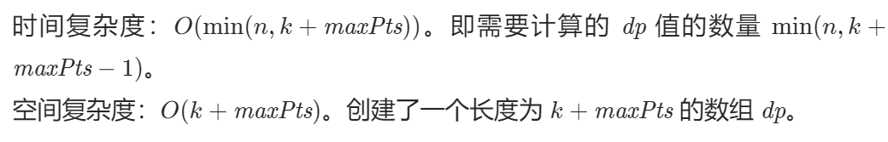

# WEEK 3

### `剑指36、 二叉搜索树与双向链表`

> ```C++
> /*
> // Definition for a Node.
> class Node {
> public:
>  int val;
>  Node* left;
>  Node* right;
> 
>  Node() {}
> 
>  Node(int _val) {
>      val = _val;
>      left = NULL;
>      right = NULL;
>  }
> 
>  Node(int _val, Node* _left, Node* _right) {
>      val = _val;
>      left = _left;
>      right = _right;
>  }
> };
> */
> /*
> 思路：中序遍历
> 左子树的最后一个指针指向root，root的右指针指向右子树最左节点
> 怎么实现上面的思路是最大的难点
> */
> class Solution {
> private: 
>  //pre用来指代左子树最后一个节点
>  Node *pre,*head;
>  void inOrder(Node* root){
>      if(root==nullptr) return;
>      inOrder(root->left);
>    //将左子树的最后一个节点的右指针指向根节点
>      if(pre!=nullptr) pre->right=root;
>      //一开始pre为空，将头节点指向root，初始化头节点
>      else head=root;
>     //当前根的左指针指向左子树的最后一个节点
>      root->left=pre;
>      //更新左子树最后的节点
>      pre=root;
>      //由于是中序遍历，所以最后一个节点一定是最右边最后面的节点
>      inOrder(root->right);
>  }
> public:
>  Node* treeToDoublyList(Node* root) {
>      if(!root) return nullptr;
>      inOrder(root);
>      head->left=pre;
>      pre->right=head;
>      return head;
>  }
> };
> ```
>
> 这道题对我最大难点在于明白是中序遍历以后能不能头脑清晰写出指针操作的顺序

### `837、新21点`

> 我的题解时间复杂度是 **`O(n+k*maxPts)`** 真的会谢
>
> 
>
> ```C++
> class Solution {
> private:
> double dp[10001]={0.0000000};
> public:
>  double new21Game(int n, int k, int maxPts) {
>      // k=0的特殊情况
>      if(k==0) return 1.00000;
>      double p=1/(double)maxPts;
>      //初始化1-matPts的概率
>      for(int i=1;i<=maxPts;i++){
>          dp[i]=p;
>      }
>      for(int i=1;i<k;i++){
>          for(int j=1;j<=maxPts;j++){
>              // ---------第一个踩坑----------------------这个if判断非常重要，否则dp数组越界
>              if(i+j<=n) dp[i+j]=dp[i+j]+dp[i]*p;
>          }
>      }
>      double res=0.00000001;
>      //累计k到n的不为零的和
>      for(int i=k;abs(dp[i]-0.000000)>0.000001&&i<=n;i++){
>          cout<<dp[i]<<" ";
>          res+=dp[i];
>      }
>      cout<<endl;
>      return res;
>  }
> };
> ```
>
> **官方题解**
>
> ### `这题需要推导数学公式，利用隔项差挺巧妙的，还要注意为了利用隔项差，需要确定起点值（即dp[k-1]）`
>
> dp[i] 代表得分为 i 的情况开始并且获胜的概率
>
> ```C++
> class Solution {
> public:
>  double new21Game(int n, int k, int maxPts) {
>      //特殊情况k=0必然获胜
>      if (k == 0) {
>          return 1.0;
>      }
>      vector<double> dp(k + maxPts);
>      //初始的成绩大于k且小于n必然获胜
>      for (int i = k; i <= n && i < k + maxPts; i++) {
>          dp[i] = 1.0;
>      }
>      //dp[k-1]只能从k到n的情况来，因此概率是1*较小个数的份额
>      dp[k - 1] = 1.0 * min(n - k + 1, maxPts) / maxPts;
>      for (int i = k - 2; i >= 0; i--) {
>          //这里是公式推导------------------写成 dp[i+1]-dp[i]=(dp[i + maxPts + 1] - dp[i + 1]) / maxPts 更好理解
>          dp[i] = dp[i + 1] - (dp[i + maxPts + 1] - dp[i + 1]) / maxPts;
>      }
>      return dp[0];
>  }
> };
> 
> ```
>
> 

### `70、爬楼梯`

> ```C++
> class Solution {
> public:
>  int climbStairs(int n) {
>     int *dp = new int[n + 1];
>      dp[0] = 1;
>      dp[1] = 1;
>      for(int i = 2; i <= n; i++) {
>          dp[i] = dp[i - 1] + dp[i - 2];
>      }
>      return dp[n];
>  }
> };
> //这题好久前写过了
> ```
>
> 

### `416、分割等和子集`

> 

### `1049、最后一块石头的重量`

> 